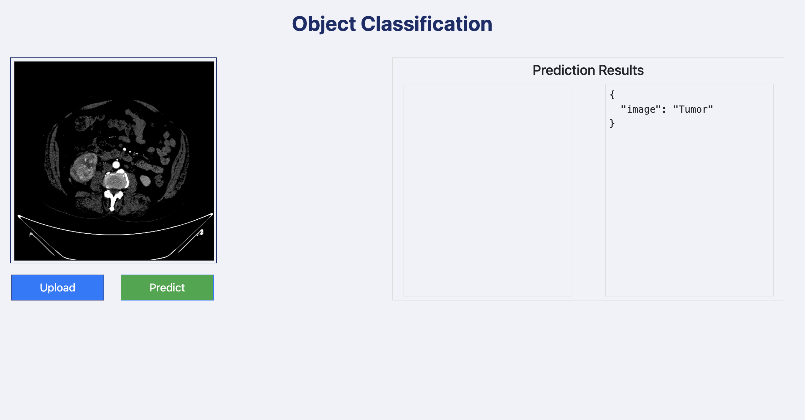
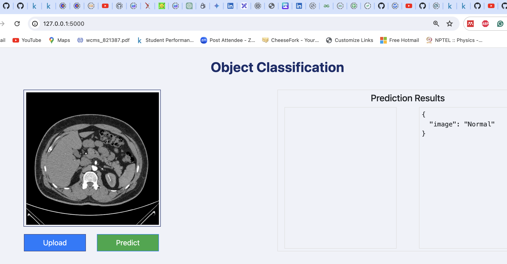

## End to end Kidney disease classification project using mlflow






# 𝐏𝐫𝐨𝐣𝐞𝐜𝐭 𝐎𝐯𝐞𝐫𝐯𝐢𝐞𝐰:
In this project, I utilized CNN and Transfer Learning techniques to develop a model capable of classifying kidney images into kidneys with tumor and normal kidneys. I leveraged the power of Convolutional Neural Networks (CNN), a class of deep neural networks, to process and analyse images. By implementing Transfer Learning with VGG16, a pre-trained deep learning model, I fine-tuned the base model to classify kidney images with "accuracy": 0.9666666388511658 and "loss": 0.12115874141454697.

To provide better user experience a web application is built using Flask web framework and a trained CNN classifier model. Users can interact with the system by uploading kidney images through our user-friendly interface. The backend processes the uploaded images, makes predictions using a pre-trained model, and returns the results.

# Data contains 203 images belonging two classes "normal" and "tumor"
The model was trained on a local machine, with relatively small dataset due to the limited processing power of the local machine.
dataset link: https://drive.google.com/file/d/15EoQXCKhMYBU8mjxnpVebni-JAZmtezo/view?usp=sharing

## Workflows
1. Update config.yaml
2. Update secrets.yaml [optional]
3. Update params.yaml
4. Update the entity
5. Update the configuration manager in src config
6. update the components
7. Update the pipeline
8. Update main.py
9. Update the app.py


# How to run?
### STEPS:

Clone the repository

```bash
https://github.com/ravina029/KidneyDisease_end_to_end/tree/main
```
### STEP 01- Create a conda environment after opening the repository

```bash
conda create -p kidneyvenv python=3.8 -y ,#exactly python=3.8.18
```

```bash
conda activate kidneyvenv
```


### STEP 02- install the requirements
```bash
pip install -r requirements.txt
```


```bash
# Finally run the following command
python app.py
```

Now,
```bash
open up you local host and port
```


## MLflow

MLflow is an open-source platform for managing the end-to-end machine learning lifecycle. 
It is designed to simplify the process of tracking experiments, 
packaging code into reproducible runs, and sharing and deploying models.

##### cmd
- mlflow ui

### dagshub
[dagshub](https://dagshub.com/)

MLFLOW_TRACKING_URI=https://dagshub.com/ravina029/KidneyDisease_end_to_end.mlflow \
MLFLOW_TRACKING_USERNAME=ravina029 \
MLFLOW_TRACKING_PASSWORD=221d4e3a527ff8b9aef06e059d7efc4e89963e11 \
python script.py


Run this to export as env variables:

```bash

export MLFLOW_TRACKING_URI=https://dagshub.com/ravina029/KidneyDisease_end_to_end.mlflow

export MLFLOW_TRACKING_USERNAME=ravina029

export MLFLOW_TRACKING_PASSWORD=221d4e3a527ff8b9aef06e059d7efc4e89963e11

```
## DVC commands
1. dvc init
2. dvc repro
3. dvc dag


# AWS-CICD-Deployment-with-Github-Actions

## 1. Login to AWS console.

## 2. Create IAM user for deployment

	#with specific access

	1. EC2 access : It is virtual machine,
 	Accessing an Amazon EC2 instance involves connecting to it remotely, typically using Secure Shell (SSH) for 
  	Linux instances or Remote Desktop Protocol (RDP) for Windows instances.

	2. ECR: Elastic Container registry to save your docker image in aws


	#Description: About the deployment

	1. Build docker image of the source code

	2. Push your docker image to ECR

	3. Launch Your EC2 

	4. Pull Your image from ECR in EC2

	5. Lauch your docker image in EC2

	#Policy:

	1. AmazonEC2ContainerRegistryFullAccess

	2. AmazonEC2FullAccess

	
## 3. Create ECR repo to store/save docker image
    - Save the URI: 381491959516.dkr.ecr.eu-north-1.amazonaws.com/kidney
	
## 4. Create EC2 machine (Ubuntu) 

## 5. Open EC2 and Install docker in EC2 Machine:
	
	
	#optinal

	sudo apt-get update -y

	sudo apt-get upgrade
	
	#required

	curl -fsSL https://get.docker.com -o get-docker.sh

	sudo sh get-docker.sh

	sudo usermod -aG docker ubuntu

	newgrp docker
	
# 6. Configure EC2 as self-hosted runner:
    setting>actions>runner>new self hosted runner> choose os> then run command one by one


# 7. Setup github secrets:

    AWS_ACCESS_KEY_ID=

    AWS_SECRET_ACCESS_KEY=

    AWS_REGION = eu-north-1

    AWS_ECR_LOGIN_URI = 381491959516.dkr.ecr.eu-north-1.amazonaws.com
    ECR_REPOSITORY_NAME = kidney


## MLflow 
MLflow

 - Its Production Grade
 - Trace all of your expriements
 - Logging & tagging your model


# Link for the live demo of this project
https://www.youtube.com/watch?v=8diI4cReACY
